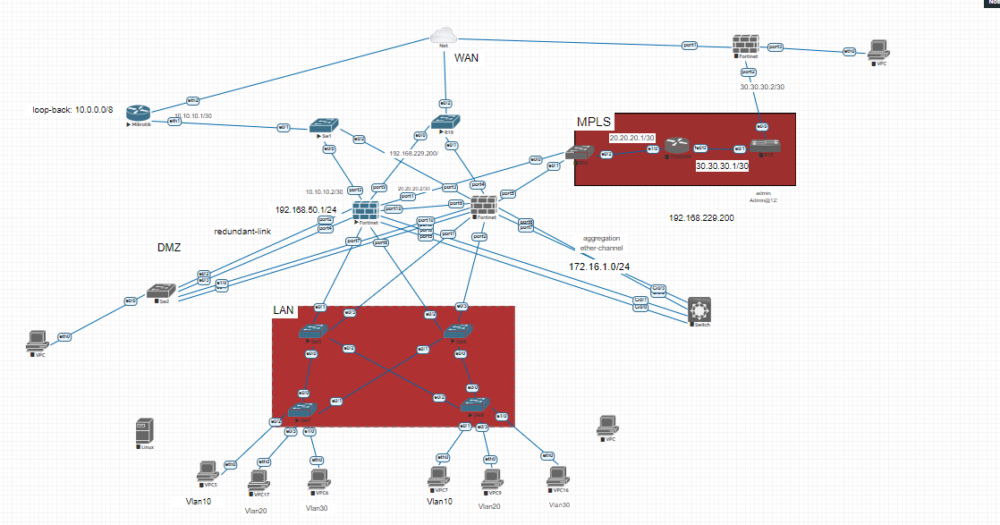

# Fortigate




# fortigate 1 config
```
# set ip to interface
config system interface
edit port1
set mode static
 set ip 192.168.229.200/24
set allowaccess ping https http ssh
end


# change admin user in terminal
Config system admin
Edit admin
Set password <password>


# disable password recovery
NGFW01 # config system global 
NGFW01 (global) # set admin-maintainer disable


# config ether channel 

NGFW01 # config system global 
NGFW01 (global) # set admin-maintainer disable
NGFW01 # config system interface 
NGFW01 (interface) # edit Agrigate-SRV 
NGFW01 (Agrigate-SRV) # set lacp-mode active 


# config custom NTP-server

config system ntp
    set ntpsync enable
    set type custom
    set syncinterval 60
config ntpserver
    edit 1
        set server "1.1.1.1"   <- NTP server IP
        set ntpv3 disable
    next

end
    set source-ip 0.0.0.0
    set server-mode disable
end

```